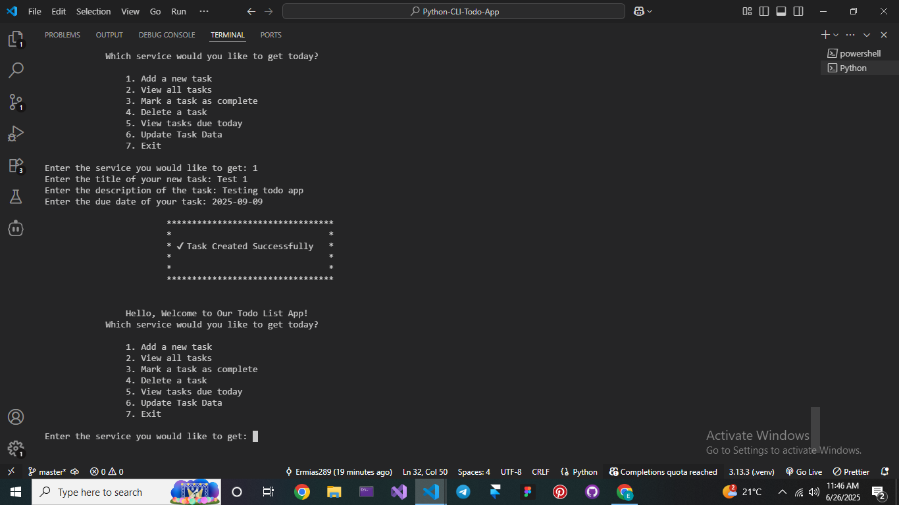
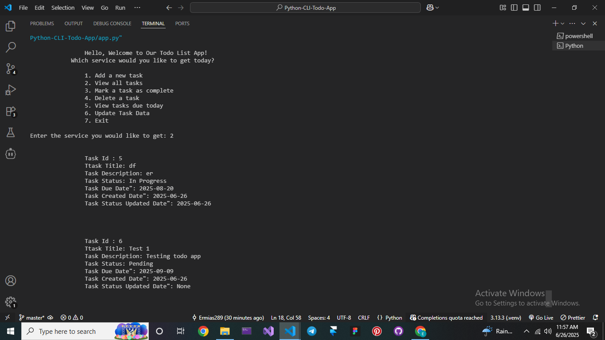
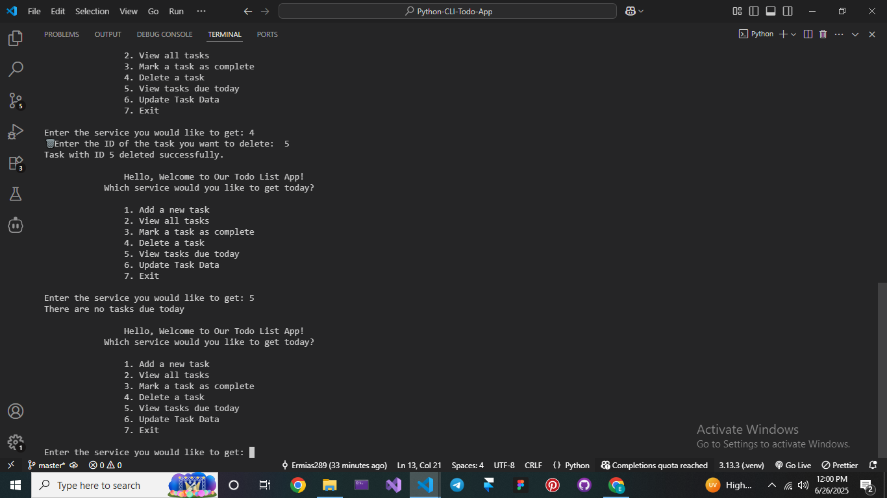
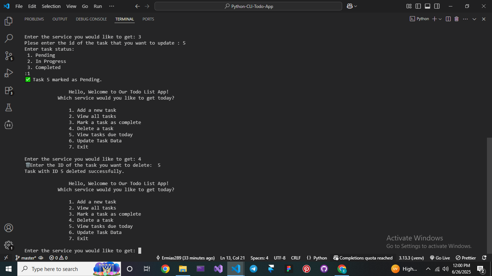
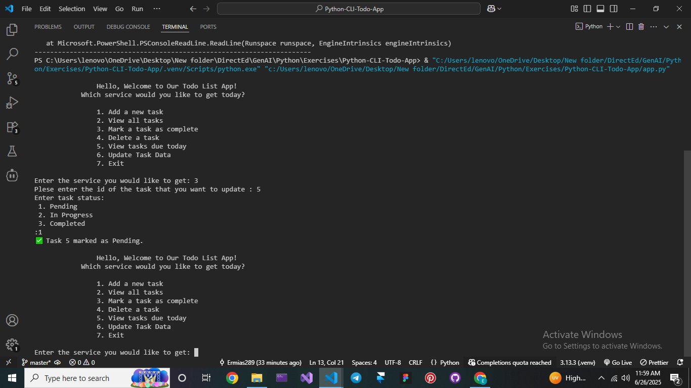

# 📝 Todo List CLI App

This is a simple Python-based **Command Line Interface (CLI)** Todo List App that allows users to create, view, update, and manage tasks directly from the terminal. It uses a local JSON file (`tasks.json`) for storing all task data.

---

## 🚀 Features

- ✅ Add new tasks with title, description, and due date
- 📋 View all tasks
- 🔁 Mark tasks as **Pending**, **In Progress**, or **Completed**
- 🗑️ Delete a task by its ID
- 📅 Show tasks due today
- ✏️ Update existing task data
- ❌ Exit the program gracefully

---

## 🛠️ Technologies Used

- Python 3.x
- Built-in modules:
  - `json`
  - `time`
  - `sys`
  - `datetime`

---

## 📂 Project Structure

